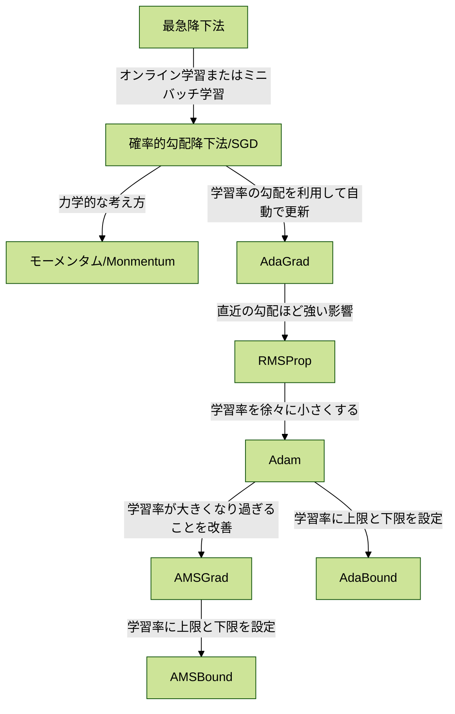

## 勾配降下法

## 物体認識タスク

- AlexNet(8層)
  - ILSVR2012にて優勝
  - ジェフリー・ヒントンが率いたチーム
- GoogLeNet(22層)
  - ILSVR2014にて優勝
  - Inceptionモジュールの導入
- VGG16(16層)
  - ILSVR2014にて準優勝
  - フィルタサイズを3✕3に統一
- ResNet(152層)
  - ILSVR2015にて優勝 
  - スキップ結合の導入
- WideResNet
  - フィルタ数を増やす
- DenseNet
  - Dense Block
- SENet
  - ILSVR2017にて優勝
  - Attention機構の導入
- MovileNet
  - メモリ量が限られている環境での利用を想定
  - 畳み込み層にDepthwise Separable Convoluctionを利用してパラメータ数を削減する 
