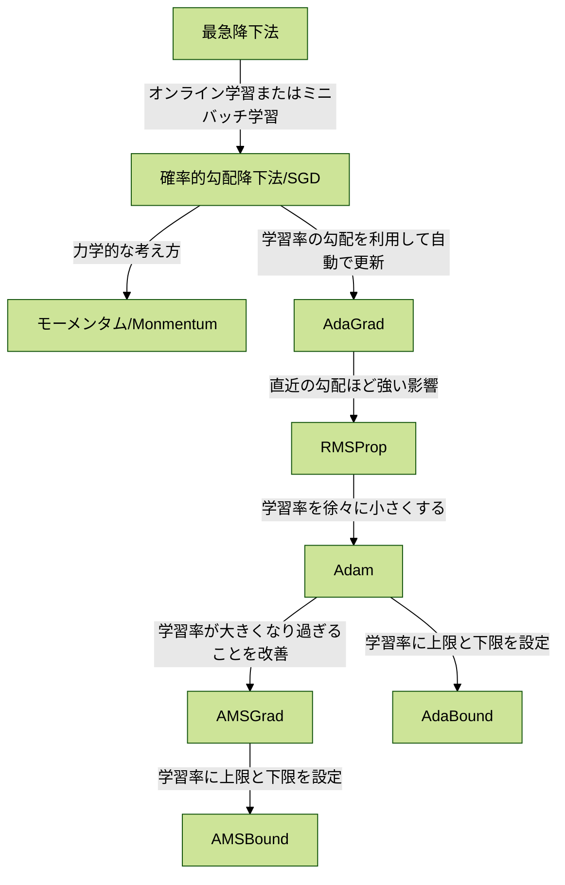

## 勾配降下法

## 物体認識タスク

- AlexNet
  - 2012年ILSVRC優勝
- VGG
  - フィルタサイズを3✕3に統一
- GoogLeNet
  - 2014年ILSVRC優勝
  - Inceptionモジュールの導入
- ResNet
  - スキップ結合の導入
- WideResNet
  - フィルタ数を増やす
- DenseNet
  - スキップ結合を工夫した派生モデル
- SENet
  - ILSVRC2017年優勝
  - Attention機構の導入
- MovileNet
  - メモリ量が限られている環境での利用を想定
  - 畳み込み層にDepthwise Separable Convoluctionを利用してパラメータ数を削減する 
